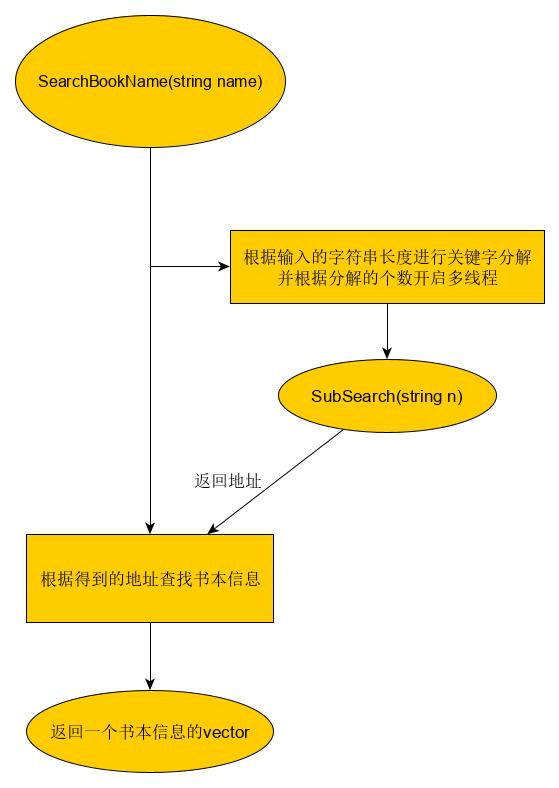

# 技术文档-搜索

## 10月1日

### 确定书本存储的数据结构

```c++
struct Book
{
	string id;
	string name;
	string author;
	string press;		//出版社
	string category;	//学科
	long pubdate;		//出版日期
	bool type;			//借阅状态
	int num;			//借阅次数
	float price;
};
// 书名索引
struct BookNameIndex
{
	char name[avglen];
	long index;
};

```

#### 实现利用书名索引进行搜索

```c++
class SearchTool
{
private:
	static string bookName;					//书本信息文件名
	static void SubSearch(std::string n);	//实现在书名索引内搜索关键字
	static bool find(char s1[], char s2[]);	//判断s1是否包含s2

public:
	// 静态操作方法
	static std::vector<Book> SearchName(std::string name);	//按名字查找，已实现
	static std::vector<Book> SearchNum(int num);			//按编号查找，待实现
	static std::vector<Book> SearchAuthor(char author[10]);	//按作者查找，待实现

    //分别是长整型、整型、浮点型与字节数组的转换
	static void ltob(long n, char * s);
	static void itob(int n, char * s);
	static void ftob(float n, char *s);
	static long btol(char *s);
	static int btoi(char *s);
	static float btof(char *s);


public:
	SearchTool();
	~SearchTool();
};
```

目前已经实现按书名进行搜索，但并未进行大规模数据测试

### 算法示意图



接下来实现按照编号进行搜索

## 10月4日

完成按照编号索引，数据格式如下：

```c++
struct BookNumIndex
{
	int num;
	long index;
};
```

编号查找算法较为简单

```c++
std::vector<Book> SearchTool::SearchBookNum(int num)
{
	ifstream io("BookNumIndex.dat", ios::in | ios::binary);
	std::vector<Book> book;
	int size = sizeof(int) + sizeof(long);
	char tmp[500];
	char n[20];
	itob(num, n);//将编号转换为字符串

	while (!io.eof())
	{
		io.read(tmp, size);
		tmp[size] = '\0';
		if (cmp(tmp, n, sizeof(int)))//找到匹配的之后直接根据地址获取书本信息
		{
			split(tmp, n, sizeof(int), sizeof(long));
			long idx = btol(n);
			ifstream in(bookName, ios::in | ios::binary);
			in.seekg(idx, ios::beg);
			in.read(tmp, bookInfoSize);
			book.push_back(bookup(tmp));
			return book;
		}
	}
	return book;
}
```

直接在编号索引表中查找匹配传入的编号，找到之后立即根据地址在书本文件中查找对应的书本信息

另外更新比较函数用于判断 s1 、s2 在 size 的长度内是否相同

```c++
bool cmp(char *s1, char *s2, int size);
```

